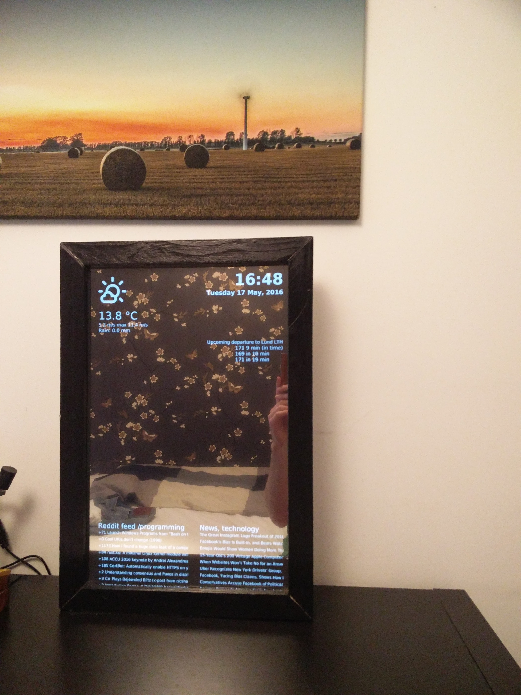
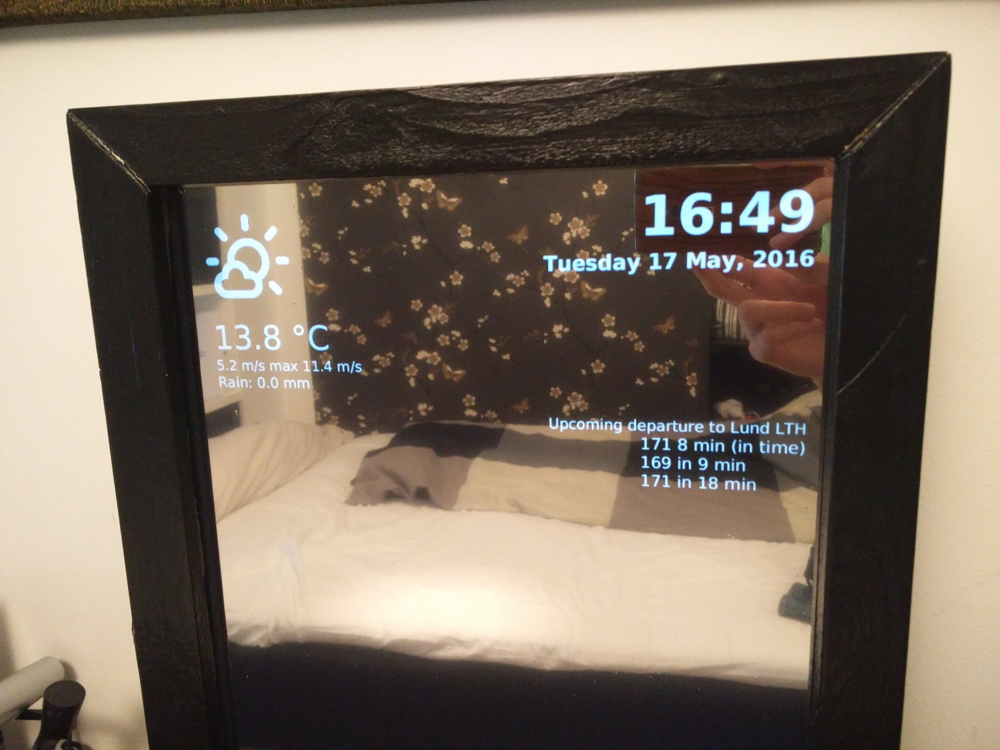

# MagicMirrorAPI
=======
An application to display a GUI behind a observation mirror on an Raspberry Pi or similar.

- News are fetched from New York Times.
- Weather from SMHI
- Bus departures from Skånetrafiken
- Reddit posts from Reddit's API

## Configuration
All configuration us done inside the config.properties file.

New York Times API key retrieval can be found here: http://developer.nytimes.com/

## Running
´´´$ java -jar MagicMirrorAPI.jar´´´

## Pics

